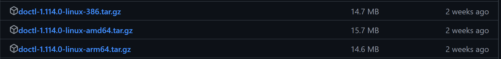
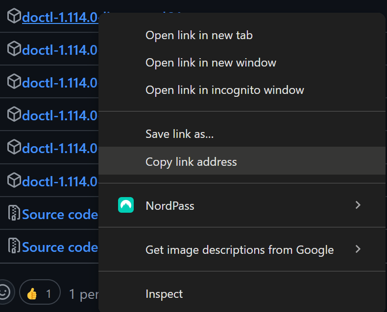
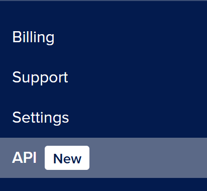
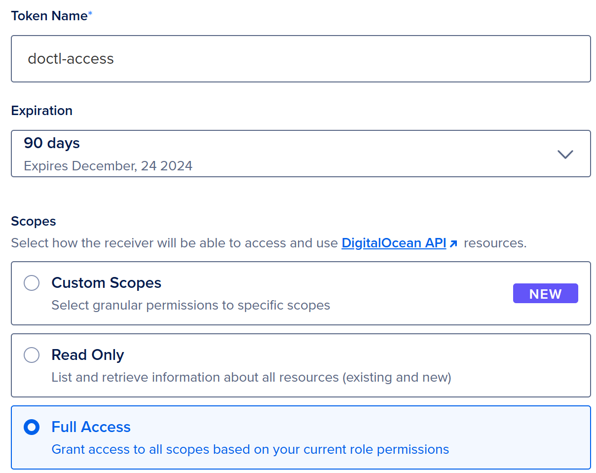
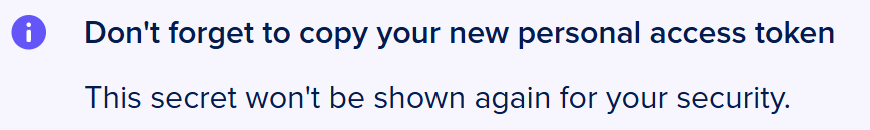
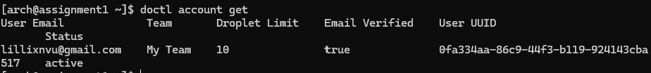
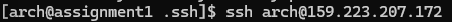

## DigitalOcean: Setting Up and Configuring Droplets with `doctl` and Cloud-Init
### Introduction:

Welcome to **DigitalOcean: Setting Up and Configuring Droplets with `doctl` and Cloud-Init**. DigitalOcean is a cloud infrastructure provider that offers virtual private servers called Droplets. These Droplets can be used for many tasks, such as web hosting, development, and managing databases.

---
### Intended Use:
This manual aims to guide users through the process of creating and managing DigitalOcean Droplets using the `doctl` command-line tool and configuring them with cloud-init. By following this guide, users will learn how to deploy and automate the setup of remote servers.

---

### Assumption Regarding Knowledge Level 

This tutorial assumes the following:
- **Arch Linux Droplet**: The reader already has an Arch Linux Droplet set up on DigitalOcean and can SSH into it.
- **Terminal Access**: All code and commands in this tutorial will be executed through the terminal, so the reader should have a working knowledge of terminal commands.
- **Command Explanations**: Every command and its options will be explained at least once in the tutorial to ensure clarity, even if the reader is not fully familiar with each tool or option.
- **Neovim Installed**: You will need Neovim to edit configuration files. If Neovim is not installed, you can add it using `sudo pacman -S neovim`.
- **A Computer Running Arch Linux**: The steps and commands provided assume the reader is working on a system running Arch Linux.

---

### Installing and Configuring `doctl`
This section will be covering the process of installing and configuring `doctl`, which is the official command-line for interacting with the DigitalOcean API. `doctl` provides an interface for managing your DigitalOcean resources directly from your terminal, allowing you to do tasks such as creating and managing Droplets, managing DNS records, and viewing usage statistics.

---
#### Installing `doctl`

You may need to download `wget` beforehand. Please use the following command:
> What is `wget`? It is a non-interactive network downloader that allows users to download files from a server without needing to be logged into the system. It can operate in the background without interrupting ongoing processes. (ArchLinux, 2024)

```bash
sudo pacman -S wget
```

1. Visit the [Releases page](https://github.com/digitalocean/doctl/releases) for `doctl` and find the archive for your operating system and architecture. In this example, we will be using "doctl-1.114.0-linux-amd64.tar.gz"

	

2. Right click the download link you prefer and **Copy link address**.

	

3. Open your terminal and run:

	**NOTE**: Please **Paste** the previous link after `wget`

	```bash
	cd ~
	wget https://github.com/digitalocean/doctl/releases/download/v1.114.0/doctl-1.114.0-linux-amd64.tar.gz
	```

4.  Extract the binary, using `tar`, run:
	```bash
	tar xf ~/doctl-1.114.0-linux-amd64.tar.gz
	```

5. Move the `doctl` binary into your path by running:
	```bash
	sudo mv ~/doctl /usr/local/bin
	```

#### Configuring `doctl`
---
##### Create an API token
You will need a **DigitalOcean API token** as it allows `doctl` to securely interact with your DigitalOcean account and perform actions on your behalf, such as creating and managing Droplets and configuring other DigitalOcean services. (DigitalOcean, 2024)

1.  Log in to the [DigitalOcean Control Panel](https://cloud.digitalocean.com/projects?i=4ebcdcb8-f40e-4f72-8d08-b660b6748444)

2.  Click **API** on the left menu bar.

	

3. Click **Generate New Token**

	

4. Fill out the following fields:
	- **Token name**: Select a name for your token. This is your own reference.
	- **Expiration**: Select an expiration for the token. 
	-  **Scopes**: Select the permissions that determine what the token can access and do. The options depend on your team role.
		1. **Custom Scopes**: allows you to choose specific scopes from the full list.
		2. **Read Only**: allows you to only view all resources.
		3. **Full Access**: allows you full permissions of all scopes.


	

5. Click **Generate Token**

	**NOTE**: Please keep a copy of your new personal access token,  as it will not be shown for your security.
	

##### Use the API token to grant account access to `doctl`
1. Open Terminal

2. Run the following:
	```bash
	doctl auth init
	```

3. Copy and Paste your token into the terminal from the DigitalOcean page. 

	
	
4. To confirm that `doctl` is authorized, check your account details by running:
	```bash
		doctl account get
	```

5. Successful output:

	

### Creating a Droplet with `doctl`
When creating a Droplet using API, you must provide values for `region`, `size`, and `image` parameters. These parameters define the datacenter location, the machine's specifications, and the operating system for the new Droplet. (DigitalOcean, 2022)

### 1. Create your SSH keys
Before creating a Droplet, an SSH key is needed. An SSH key is a pair of cryptographic keys used for secure access to systems and services over a network. The SSH (Secure Shell) protocol is commonly used for securely connecting to remote servers and performing operations such as file transfers, command execution, and configuration management. (Cloudflare, n.d.)

1. Open terminal

2.  Run the following:

	```bash
	ssh-keygen -t ed25519 -f ~/.ssh/<your-key> -C <your-email@email.com>
	```

*example input*:


3. Once you run the previous line, you will be prompted to `Enter a passphrase for /home/arch/.ssh/do-key (empty for no passphrase):`

**NOTE**: You can leave this empty by pressing enter twice, or enter a passphrase twice.

4. Upon success, the following will show:

	

## 2. Add your public key to your DigitalOcean account
 After creating the key pair, you will need to add your public key to your DigitalOcean account as it allows you to log in to your servers without a password (DigitalOcean, 2022)

 > What is a **public key**? A public key is used for secure authentication. You generate a key pair (public and private keys), keeping the private secret, and sharing the public key. You can add your public key to a Droplet which allows you to log in via SSH without a password. (DigitalOcean, 2019)

To upload the public key to your account, run `doctl` SSH key import command with the `--public-key-file` flag to specify the location of the `.pub` file you created.

1. Run the following command:

	```bash
	doctl compute ssh-key import <name> --public-key-file ~/.ssh/<your-key>.pub
	```
**NOTE**: this import command takes two required arguments: a unique name for the key and the path to the public key file on your local machine.

2. A successful import return output looks like:

	

3. To verify a successful import, you can list the available public keys in your DigitalOcean account running:

	```bash
	doctl compute ssh-key list
	```

4. Copy your key by running the following command:
	```bash
	cat ~/.ssh/<your-key>.pub
	```

5. Paste your key somewhere for now

### 3. Configure the cloud-init File
Cloud-init enables you to configure a server with initial settings upon setup. In this guide, the example configuration includes a selection of commonly used packages to demonstrate its capabilities. (Cloud-Init, n.d.)

1. Run the following:

	```bash
	nvim cloud.config.yaml
	```

2. Press the "i" key to edit the file contents  

3. Copy and Paste the following code into file: (**NOTE**: Change at least the ssh-authorized-keys)

	```bash
	#cloud-config
	users:
		name: user-name # Change
		primary_group: user-group # Change
		groups: wheel
		shell: /bin/bash:
		sudo: ['ALL=(ALL) NOPASSWD:ALL']
		ssh-authorized-keys:
		- ssh-ed25519 ssh-public-key # Change
	packages:
	- ripgrep
	- rsync
	- neovim
	- fd
	- less
	- man-db
	- bash-completion
	- tmux
	disable_root: true
	```
>1. `users`: Defines user accounts to be created during the instance initialization.
>2. `name`: Specify the username you want to create (replace user-name with the desired username).
>3. `primary_group`: Defines the primary group for the user (replace user-group with the desired group name).
>4. `groups`: Additional groups the user should belong to; in this case, it includes wheel, which typically grants administrative privileges.
>5. `shell`: The login shell for the user; /bin/bash is a common choice for a Unix-like environment. Note that there’s an extra colon (:) at the end that should be removed.
>6. `sudo`: Specifies sudo permissions for the user; ['ALL=(ALL) NOPASSWD:ALL'] allows the user to execute any command as any user without a password.
>7. `ssh-authorized-keys`: Lists SSH public keys for passwordless login. You need to replace ssh-ed25519 ssh-public-key with the actual SSH public key.
>4. Press "esc" key to exit inset mode
>5. Type `:` then `wq` and then press enter key to save and finish
>>DigitalOcean, 2014)


### 4. Deploying a Droplet
Commands that you may need to copy to deploy a new droplet.
```bash
doctl compute image list-user 
doctl compute ssh-key list
doctl compute region list
```
>1. **`doctl compute image list-user`**: Lists images owned by the authenticated user, showing IDs and details.   
>2. **`doctl compute ssh-key list`**: Retrieves a list of SSH keys associated with the user’s account.
>3.  **`doctl compute region list`**: Lists available regions for creating Droplets, including their IDs and features.
>>(DigitalOcean, 2024)


Run the following:
```
doctl compute droplet create new-droplet \
  --image <image-id> \
  --size s-1vcpu-1gb \
  --ssh-keys <ssh-id> \
  --region <region-id> \
  --user-data-file ~/cloud.config.yaml \
  --wait
```
>1. **`doctl compute droplet create new-droplet`**: Creates a new Droplet named `new-droplet`.
>2. **`--image <image-id>`**: Specifies the image ID to use for the Droplet.
>3. **`--size s-1vcpu-1gb`**: Sets the Droplet size (1 vCPU and 1 GB RAM).
>4. **`--ssh-keys <ssh-id>`**: Associates the specified SSH key with the Droplet for secure access.
>5.**`--region <region-id>`**: Designates the region where the Droplet will be created.
>6. **`--user-data-file ~/cloud.config.yaml`**: Provides a path to a user data file for cloud-init configuration.
>7. **`--wait`**: Waits for the Droplet to be fully created before returning control.


Example Input:


Successful Output:


#### 5. Connecting to Your Droplet
##### Logging into Droplet
1. Copy the `Public IPv4` from your previous Successful Output.
2. Run the following:
```bash
ssh example-user@<your-ip-address>
```

Example Output:



##### Config File
You will need a config file as it allows you to automate the setup of your Droplet.

**NOTE**: Copy the `Public IPv4` from your previous Successful Output and save it.

1. Run the following:
	```bash
	nvim ~/.ssh/config
	```

2. Copy into the config file:
	```
	Host arch
	  HostName <ip-address>
	  User arch <name-in-cloud-init-yaml> 
	  PreferredAuthentications publickey
	  IdentityFile ~/.ssh/<key-used> 
	  StrictHostKeyChecking no
	  UserKnownHostsFile /dev/null
	```

Example Input:


3. Move your config file to your `.ssh` folder
	```bash
	mv config .ssh
	```


### Glossary

**API Token** - Unique identifier that allows doctl to securely access and manage your DigitalOcean account. It enables various actions, such as creating and configuring Droplets.

  

**Cloud-init** - A tool used for automating the initial configuration of cloud instances. It allows users to define how a server should be set up when it first boots.

  

**Droplet** - A virtual private server (VPS) provided by DigitalOcean. Droplets can be used for a variety of purposes, including web hosting, application development, and database management. (DigitalOcean, 2024)

  

**Neovim** - An extensible text editor designed for efficient coding. Neovim is used in this tutorial to edit configuration files.

  

**SSH Key** - A pair of cryptographic keys used for secure access to systems over a network. An SSH key pair consists of a public key, which is shared with servers, and a private key, which is kept secret.

  

**doctl** - The official command-line tool for interacting with the DigitalOcean API. It allows users to manage DigitalOcean resources directly from the terminal.

  

**Public IPv4** - The public internet address assigned to a Droplet. It is used to connect to the server over the internet.

  

**User-data File** - A file containing configurations that cloud-init reads upon the initial setup of a Droplet. It specifies user accounts, installed packages, and other configurations.

  

**SSH (Secure Shell)** - A protocol used to securely access and manage remote servers over a network. SSH allows users to execute commands and transfer files securely.

  

**Configuration File** - A file that contains settings and parameters for programs or services. In this context, it refers to the SSH config file that automates the login process to a Droplet.


---
### Resources
DigitalOcean. (2020, April). doctl Command Line Interface (CLI). DigitalOcean. https://docs.digitalocean.com/reference/doctl/

DigitalOcean. (2022, October). How to Create a Droplet. DigitalOcean. https://docs.digitalocean.com/products/droplets/how-to/create/

DigitalOcean. (2022, September). How to Automate Droplet Setup with cloud-init. DigitalOcean. https://docs.digitalocean.com/products/droplets/how-to/automate-setup-with-cloud-init/

DigitalOcean. (2014, October). How To Use Cloud-Config For Your Initial Server Setup. DigitalOcean. https://www.digitalocean.com/community/tutorials/how-to-use-cloud-config-for-your-initial-server-setup

DigitalOcean. (2024, July). doctl compute droplet list. DigitalOcean. https://docs.digitalocean.com/reference/doctl/reference/compute/droplet/list/

DigitalOcean. (2024, August). cat.1. Arch Linux. https://man.archlinux.org/man/cat.1

DigitalOcean. (2024, September). Droplets documentation. DigitalOcean. https://docs.digitalocean.com/products/droplets/

DigitalOcean. (2020, April). Install doctl: The DigitalOcean command-line client. DigitalOcean. https://docs.digitalocean.com/reference/doctl/how-to/install/

DigitalOcean. (2024, August). Create a personal access token. DigitalOcean. https://docs.digitalocean.com/reference/api/create-personal-access-token/

Cloud-init. (n.d.). Introduction to cloud-init. Cloud-init. https://docs.cloud-init.io/en/latest/explanation/introduction.html

Cloudflare. (n.d.). What is SSH?. Cloudflare. https://www.cloudflare.com/learning/access-management/what-is-ssh/

DigitalOcean. (2024, April). SSH essentials: Working with SSH servers, clients, and keys. DigitalOcean. https://www.digitalocean.com/community/tutorials/ssh-essentials-working-with-ssh-servers-clients-and-keys

Arch Linux. (n.d.). Cloud-init. Arch Linux. https://wiki.archlinux.org/title/Cloud-init

Arch Linux. (n.d.). Arch manual pages. Arch Linux. https://man.archlinux.org/

DigitalOcean. (2019, August). How to Add SSH Keys to New or Existing Droplets. DigitalOcean. https://docs.digitalocean.com/products/droplets/how-to/add-ssh-keys/